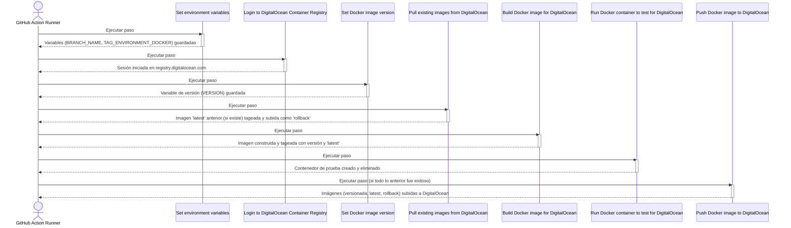

# Push to DigitalOcean Container Registry Action

*  [Ingles](README.md)
*  [Español](README.es.md)

## 📘 1. ¿Qué hace esta Action?

Esta GitHub Action automatiza el proceso de construir una imagen de Docker y publicarla en el DigitalOcean Container Registry. Su objetivo es estandarizar el despliegue continuo (CI/CD) al vincular ramas específicas de Git con etiquetas de entorno dentro del registro de DigitalOcean.

El flujo de trabajo es el siguiente:

1. **Determina el entorno:** Identifica la rama de Git que activó el workflow (ej. main, development) y la mapea a una etiqueta de entorno (ej. prod, dev) mediante un mapa JSON configurable. Si la rama no se encuentra en el mapa, la Action falla.

2. **Genera una versión única:** Crea una etiqueta de versión única para la imagen de Docker basada en la fecha y hora UTC actual (ej. 20231027T153000Z).

3. **Gestiona el rollback:** Antes de construir, intenta descargar la imagen :latest existente del entorno correspondiente desde el registro de DigitalOcean. Si la encuentra, la re-etiqueta como :rollback y la sube de nuevo, conservando así una versión anterior para posibles restauraciones.

4. **Construye y prueba la imagen:** Construye una nueva imagen de Docker usando el Dockerfile especificado. Una vez construida, la etiqueta con la versión única y también como :latest. Realiza una prueba rápida (smoke test) iniciando un contenedor a partir de la imagen y eliminándolo inmediatamente para verificar su integridad.

5. **Publica en DigitalOcean:** Si los pasos anteriores tienen éxito, sube al DigitalOcean Container Registry la imagen con su etiqueta de versión única, la etiqueta :latest del entorno y la etiqueta :rollback (si fue creada).

Esta Action es ideal para proyectos que utilizan una estrategia de ramas por entorno y necesitan un proceso automatizado y consistente para sus despliegues en el DigitalOcean Container Registry.

## ⚙️ 2. Inputs Requeridos

A continuación se detallan los parámetros de entrada que la Action utiliza:

| Nombre del input | ¿Requerido? | Valor por defecto | Descripción técnica |
|-----------------|-------------|-------------------|-------------------|
| digitalocean-token | ✅ | N/A | El token de acceso de DigitalOcean (do_token) con permisos de escritura para autenticarse en el Container Registry. |
| digitalocean-repository | ✅ | N/A | El nombre del repositorio en tu DigitalOcean Container Registry (ej. mi-registro/mi-app). |
| branch-environment-map | ❌ | `{"main": "prod", "development": "dev", "staging": "stg", "testing": "tst"}` | Un objeto JSON que mapea los nombres de las ramas de Git a las etiquetas de entorno. La clave es el nombre de la rama y el valor es la etiqueta a usar. |
| dockerfile-path | ❌ | deployments/Dockerfile.deploy | La ruta relativa al Dockerfile que se utilizará para construir la imagen. |

## 📈 3. Diagrama secuencial paso a paso

El siguiente diagrama ilustra el flujo de ejecución de la Action, desde la configuración inicial hasta la publicación final de la imagen en DigitalOcean.

## 🧠 4. Algoritmo detallado

A continuación se describe el proceso que realiza la Action, paso por paso:

### Set environment variables (Establecer variables de entorno)
- Extrae el nombre de la rama de la variable GITHUB_REF y lo guarda en BRANCH_NAME.
- Lee el input branch-environment-map y usa jq para encontrar el valor asociado a la BRANCH_NAME, guardándolo en TAG_ENVIRONMENT_DOCKER.
- Condición: Si no hay correspondencia para la rama, el script falla con código de error 1.
- Exporta BRANCH_NAME y TAG_ENVIRONMENT_DOCKER al entorno de GitHub ($GITHUB_ENV).

### Debug Environment Variables (Depurar variables de entorno)
- Imprime los valores de TAG_ENVIRONMENT_DOCKER y BRANCH_NAME para depuración.

### Login to DigitalOcean Container Registry (Iniciar sesión en el Registro de Contenedores de DigitalOcean)
- Ejecuta docker login para el host registry.digitalocean.com.
- Utiliza el digitalocean-token proporcionado como contraseña a través de stdin para una autenticación segura.

### Set Docker image version (Establecer la versión de la imagen Docker)
- Genera una marca de tiempo UTC en formato YYYYMMDDTHHMMSSZ y la guarda en la variable DATE_UTC.
- Exporta este valor como la variable VERSION al entorno de GitHub.

### Debug Docker Version (Depurar la versión de Docker)
- Imprime el valor de VERSION para depuración.

### Pull existing images from DigitalOcean (Descargar imágenes existentes de DigitalOcean)
- Intenta descargar la imagen latest del entorno actual (ej. registry.digitalocean.com/mi-repo:prod-latest).
- Condición (Éxito): Si la imagen se descarga:
  - La re-etiqueta con el sufijo -rollback (ej. registry.digitalocean.com/mi-repo:prod-rollback).
  - Sube esta nueva imagen rollback al registro de DigitalOcean.
- Condición (Fallo): Si no existe una imagen latest, muestra un mensaje y continúa.

### Build Docker image for DigitalOcean (Construir la imagen de Docker para DigitalOcean)
- Construye el nombre completo de la imagen (IMAGE_NAME) usando el endpoint del registro, el repositorio, el tag de entorno y la versión.
- Exporta IMAGE_NAME al entorno de GitHub.
- Ejecuta docker build usando el Dockerfile del dockerfile-path.
- Etiqueta la imagen recién construida con el IMAGE_NAME completo.
- Adicionalmente, la etiqueta también como -latest para el entorno actual.

### Debug Build Info (Depurar información de la construcción)
- Imprime el IMAGE_NAME y lista todas las imágenes de Docker locales.

### Run Docker container to test for DigitalOcean (Ejecutar contenedor para probar)
- Inicia un contenedor de prueba (test_container) en segundo plano a partir de la imagen recién creada ($IMAGE_NAME).
- Lista los contenedores para verificar su estado y lo elimina inmediatamente.

### Push Docker image to DigitalOcean (Subir la imagen de Docker a DigitalOcean)
- Condición: Este paso solo se ejecuta si todos los anteriores fueron exitosos (if: success()).
- Sube la imagen con la etiqueta de versión única ($IMAGE_NAME).
- Sube la imagen con la etiqueta -latest del entorno.
- Condición: Si una imagen con la etiqueta -rollback existe localmente, también la sube.

### Debug Info (Información de depuración)
- Imprime el IMAGE_NAME y lista las imágenes locales.
- Realiza un segundo docker login en DigitalOcean y vuelve a subir las imágenes latest y versionada como medida de verificación final. 