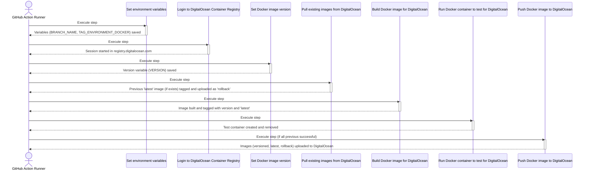

# Push to DigitalOcean Container Registry Action

## Idiomas

*  [English](README.md)
*  [Spanish](README.es.md)

### 📘 1. What does this Action do?

This GitHub Action automates the process of building a Docker image and publishing it to the DigitalOcean Container Registry. Its purpose is to standardize continuous deployment (CI/CD) by linking specific Git branches with environment tags within the DigitalOcean registry.

The workflow is as follows:

1. **Determine environment:** Identifies the Git branch that triggered the workflow (e.g., main, development) and maps it to an environment tag (e.g., prod, dev) using a configurable JSON map. If the branch is not found in the map, the Action fails.

2. **Generate unique version:** Creates a unique version tag for the Docker image based on the current UTC date and time (e.g., 20231027T153000Z).

3. **Handle rollback:** Before building, attempts to download the existing :latest image for the corresponding environment from the DigitalOcean registry. If found, it re-tags it as :rollback and uploads it back, thus preserving a previous version for possible rollbacks.

4. **Build and test image:** Builds a new Docker image using the specified Dockerfile. Once built, tags it with the unique version and also as :latest. Performs a quick smoke test by starting a container from the image and immediately removing it to verify its integrity.

5. **Publish to DigitalOcean:** If the previous steps are successful, uploads to the DigitalOcean Container Registry the image with its unique version tag, the environment's :latest tag, and the :rollback tag (if created).

This Action is ideal for projects that use a branch-per-environment strategy and need an automated and consistent process for their deployments in the DigitalOcean Container Registry.

### ⚙️ 2. Required Inputs

Below are the input parameters that the Action uses:

| Input name | Required? | Default value | Technical description |
|------------|-----------|---------------|---------------------|
| digitalocean-token | ✅ | N/A | The DigitalOcean access token (do_token) with write permissions to authenticate in the Container Registry. |
| digitalocean-repository | ✅ | N/A | The repository name in your DigitalOcean Container Registry (e.g., my-registry/my-app). |
| branch-environment-map | ❌ | `{"main": "prod", "development": "dev", "staging": "stg", "testing": "tst"}` | A JSON object that maps Git branch names to environment tags. The key is the branch name and the value is the tag to use. |
| dockerfile-path | ❌ | deployments/Dockerfile.deploy | The relative path to the Dockerfile that will be used to build the image. |

### 📈 3. Step-by-step Sequence Diagram

The following diagram illustrates the Action's execution flow, from initial configuration to final image publication in DigitalOcean.

### 🧠 4. Detailed Algorithm

Below is a step-by-step description of the process that the Action performs:

### Set environment variables
- Extracts the branch name from the GITHUB_REF variable and stores it in BRANCH_NAME.
- Reads the branch-environment-map input and uses jq to find the value associated with BRANCH_NAME, storing it in TAG_ENVIRONMENT_DOCKER.
- Condition: If there's no match for the branch, the script fails with error code 1.
- Exports BRANCH_NAME and TAG_ENVIRONMENT_DOCKER to the GitHub environment ($GITHUB_ENV).

### Debug Environment Variables
- Prints the values of TAG_ENVIRONMENT_DOCKER and BRANCH_NAME for debugging.

### Login to DigitalOcean Container Registry
- Executes docker login for the registry.digitalocean.com host.
- Uses the provided digitalocean-token as password through stdin for secure authentication.

### Set Docker image version
- Generates a UTC timestamp in YYYYMMDDTHHMMSSZ format and stores it in the DATE_UTC variable.
- Exports this value as the VERSION variable to the GitHub environment.

### Debug Docker Version
- Prints the VERSION value for debugging.

### Pull existing images from DigitalOcean
- Attempts to download the latest image for the current environment (e.g., registry.digitalocean.com/my-repo:prod-latest).
- Success Condition: If the image is downloaded:
  - Re-tags it with the -rollback suffix (e.g., registry.digitalocean.com/my-repo:prod-rollback).
  - Uploads this new rollback image to the DigitalOcean registry.
- Failure Condition: If no latest image exists, displays a message and continues.

### Build Docker image for DigitalOcean
- Builds the complete image name (IMAGE_NAME) using the registry endpoint, repository, environment tag, and version.
- Exports IMAGE_NAME to the GitHub environment.
- Executes docker build using the Dockerfile from dockerfile-path.
- Tags the newly built image with the complete IMAGE_NAME.
- Additionally, tags it as -latest for the current environment.

### Debug Build Info
- Prints the IMAGE_NAME and lists all local Docker images.

### Run Docker container to test for DigitalOcean
- Starts a test container (test_container) in the background from the newly created image ($IMAGE_NAME).
- Lists the containers to verify their status and removes it immediately.

### Push Docker image to DigitalOcean
- Condition: This step only executes if all previous ones were successful (if: success()).
- Uploads the image with the unique version tag ($IMAGE_NAME).
- Uploads the image with the -latest environment tag.
- Condition: If an image with the -rollback tag exists locally, it's also uploaded.

### Debug Info
- Prints the IMAGE_NAME and lists local images.
- Performs a second docker login to DigitalOcean and re-uploads the latest and versioned images as a final verification measure.
